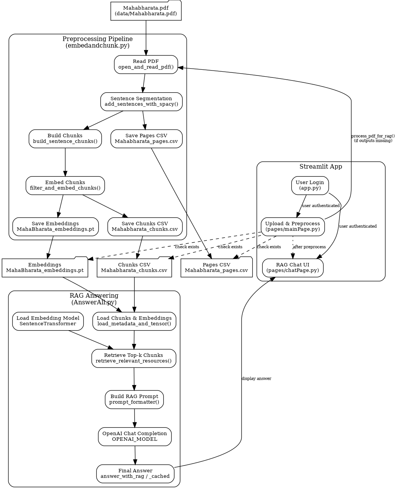

# Mahabharata RAG Streamlit App – Technical Overview

## 1. Project Overview

**Root:** `/home/prichai/AI_ML/RAG_Project`

This project is a Mahabharata-focused Retrieval-Augmented Generation (RAG) system with:

- A **Streamlit web app** that lets you:
  - Upload a Mahabharata PDF (or other PDFs).
  - Preprocess it (sentence segmentation, chunking, embedding).
  - Chat with a language model grounded in the processed text via the OpenAI API.

- A **RAG pipeline** that:
  - Reads the Mahabharata PDF.
  - Splits it into sentence-based chunks.
  - Embeds those chunks using `sentence-transformers`.
  - Stores both metadata (CSVs) and embeddings (`.pt`) for reuse.

Main app directory:

- `RAG_Streamlit_App/`
  - `app.py` – Streamlit entrypoint (login/main routing).
  - `embedandchunk.py` – PDF → chunks → embeddings pipeline.
  - `AnswerAll.py` – RAG retrieval, prompt building, and OpenAI calls.
  - `pages/mainPage.py` – PDF upload & preprocessing UI.
  - `pages/chatPage.py` – RAG chat UI.
  - `data/` – PDF, CSVs, embeddings.

---

## 2. Installation & Setup

### 2.1. Create and activate a virtual environment

From the project root (`/home/prichai/AI_ML/RAG_Project`):

```bash
python3 -m venv venv
source venv/bin/activate
```

(Windows: `.\venv\Scripts\activate`)

### 2.2. Install dependencies

```bash
pip install -r requirements.txt
```

### 2.3. Install spaCy language model

```bash
python -m spacy download en_core_web_sm
```

### 2.4. Set the OpenAI API key

Ensure you’re in the same shell/venv where you run Streamlit:

```bash
export OPENAI_API_KEY="sk-...your-key-here..."
```

To make this persistent for your user:

```bash
echo 'export OPENAI_API_KEY="sk-...your-key-here..."' >> ~/.bashrc
source ~/.bashrc
```

### 2.5. Start the app

```bash
cd RAG_Streamlit_App
streamlit run app.py
```

In your browser: `http://localhost:8501`.

---

## 3. Data Artifacts

All RAG data is stored under:

- `RAG_Streamlit_App/data/`

Key files (for Mahabharata):

- `Mahabharata.pdf` – source text.
- `Mahabharata_pages.csv` – page-level metadata & text.
- `Mahabharata_chunks.csv` – chunk-level metadata & text.
- `MahaBharata_embeddings.pt` – PyTorch tensor of chunk embeddings.

These are created by `embedandchunk.py` and consumed by `AnswerAll.py`.

---

## 4. Module-by-Module Breakdown

### 4.1. `embedandchunk.py` – PDF → Chunks → Embeddings

**Path:** `RAG_Streamlit_App/embedandchunk.py`

Purpose:

- Ingest and preprocess the Mahabharata (or another PDF).
- Perform sentence segmentation.
- Chunk sentences.
- Embed chunks and save embeddings.
- **Skip recomputation** if CSVs and embeddings already exist.

Key constants:

```python
DATA_DIR = "data"

PDF_PATH = os.path.join(DATA_DIR, "Mahabharata.pdf")
NUM_SENTENCE_CHUNK_SIZE = 10
MIN_TOKEN_LENGTH = 30  # minimum tokens per chunk

PAGES_CSV = os.path.join(DATA_DIR, "Mahabharata_pages.csv")
CHUNKS_EMBEDDINGS_CSV = os.path.join(DATA_DIR, "Mahabharata_chunks.csv")
EMBEDDINGS_TENSOR_FILE = os.path.join(DATA_DIR, "MahaBharata_embeddings.pt")

DEVICE = "cuda" if torch.cuda.is_available() else "cpu"
```

Key functions:

- `text_formatter(text: str) -> str`  
  Cleans/normalizes PDF text (e.g., whitespace, line breaks).

- `open_and_read_pdf(pdf_path: str) -> list[dict]`  
  Uses `fitz` (PyMuPDF) to open the PDF and extract text per page.

- `add_sentences_with_spacy(pages_and_texts, nlp)`  
  Runs spaCy’s `sentencizer` to split each page into sentences and attaches a sentence list to each page record.

- `build_sentence_chunks(pages_and_texts, chunk_size: int)`  
  Groups sentences into fixed-size windows (`chunk_size` sentences). Produces chunk dicts with:
  - `sentence_chunk` text.
  - `page_number` and related metadata.
  - `token_count` (for filtering short chunks).

- `filter_and_embed_chunks(pages_and_chunks, embedding_model, embeddings_tensor_path: str | None)`  
  - Filters chunks with `token_count >= MIN_TOKEN_LENGTH`.
  - Embeds them using `SentenceTransformer(EMBEDDING_MODEL_NAME)`.
  - Saves the embeddings tensor to `embeddings_tensor_path` (or `EMBEDDINGS_TENSOR_FILE`).
  - Returns a list of chunk dicts (with embeddings if needed).

- `process_pdf_for_rag(pdf_path, pages_csv_path, chunks_csv_path, embeddings_tensor_path)`  
  End-to-end function:

  1. **Early exit if outputs exist:**

     ```python
     if (
         os.path.exists(pages_csv_path)
         and os.path.exists(chunks_csv_path)
         and os.path.exists(embeddings_tensor_path)
     ):
         print("[RAG] Outputs already exist, skipping processing...")
         return
     ```

  2. Else:
     - Read PDF.
     - Run spaCy sentence splitting.
     - Save `pages_csv_path` (e.g., `data/Mahabharata_pages.csv`).
     - Build chunks.
     - Embed and save `embeddings_tensor_path` (e.g., `data/MahaBharata_embeddings.pt`).
     - Save `chunks_csv_path` (e.g., `data/Mahabharata_chunks.csv`).

This function is typically invoked from `pages/mainPage.py` when a new PDF is uploaded.

---

### 4.2. `AnswerAll.py` – RAG Retrieval and OpenAI Answers

**Path:** `RAG_Streamlit_App/AnswerAll.py`

Purpose:

- Load embeddings and metadata.
- Perform vector retrieval over chunks.
- Construct RAG prompts.
- Call the OpenAI Chat Completions API to generate answers.
- Expose simple functions for both one-shot and cached RAG usage.

Config:

```python
DATA_DIR = "data"

PDF_PATH = os.path.join(DATA_DIR, "Mahabharata.pdf")
PAGES_CSV = os.path.join(DATA_DIR, "Mahabharata_pages.csv")
CHUNKS_CSV = os.path.join(DATA_DIR, "Mahabharata_chunks.csv")
EMBEDDINGS_TENSOR_PATH = os.path.join(DATA_DIR, "MahaBharata_embeddings.pt")

EMBEDDING_MODEL_NAME = "all-mpnet-base-v2"
DEVICE = "cuda" if torch.cuda.is_available() else "cpu"

OPENAI_MODEL = "gpt-4o-mini"  # or "gpt-4o", etc.

from openai import OpenAI
openai_client = OpenAI()  # uses OPENAI_API_KEY env
```

Core helpers:

- `load_embedding_model(device: str)`  
  Loads `SentenceTransformer(EMBEDDING_MODEL_NAME)`.

- `load_metadata_and_tensor(chunks_csv, embeddings_path, device)`  
  Returns:
  - `pages_and_chunks` (list of dicts from `Mahabharata_chunks.csv`).
  - `embeddings` (tensor loaded from `MahaBharata_embeddings.pt`).

- `retrieve_relevant_resources(query, embeddings, model, top_k=5)`  
  Encodes the query, computes cosine similarity with chunk embeddings, and returns top-k scores and indices.

- `print_top_results_and_scores(...)`  
  Prints retrieval results with scores to the console (debugging/demo).

Prompt builder:

```python
def prompt_formatter(query: str, context_items: list[dict]) -> str:
    """Build concise instruction + context prompt for OpenAI chat."""
    context = "\n\n".join([item["sentence_chunk"] for item in context_items])
    prompt = f"""You are an expert on the Mahabharata and related dharma shastras.

Based ONLY on the context passages below, answer the user's question in 2–4 sentences.
First clearly say "Yes" or "No" if the question allows, then briefly explain why
using the exact ideas in the context. Do NOT add information that is not in the context.
If the answer is not in the context, say you cannot answer from the given passages.

Context:
{context}

User question: {query}

Answer:"""
    print("=== RAG QUERY ===", query)
    print("=== CONTEXT ===", context)
    print("=== PROMPT ===", prompt[:1000])
    return prompt
```

#### 4.2.1. One-shot RAG API: `answer_with_rag`

```python
def answer_with_rag(user_query: str) -> str:
    """
    Single-call RAG answer:
    - Loads metadata + embeddings + embedding model.
    - Retrieves top-k chunks.
    - Builds prompt and returns answer text via OpenAI API.
    """
    embedding_model = load_embedding_model(device=DEVICE)
    pages_and_chunks, embeddings = load_metadata_and_tensor(
        CHUNKS_CSV, EMBEDDINGS_TENSOR_PATH, device=DEVICE
    )

    scores, indices = retrieve_relevant_resources(
        query=user_query, embeddings=embeddings, model=embedding_model
    )
    context_items = [pages_and_chunks[i.item()] for i in indices]

    prompt = prompt_formatter(query=user_query, context_items=context_items)

    response = openai_client.chat.completions.create(
        model=OPENAI_MODEL,
        messages=[
            {"role": "system", "content": "You are a helpful assistant specialized in the Mahabharata."},
            {"role": "user", "content": prompt},
        ],
        temperature=0.3,
        max_tokens=256,
    )
    return response.choices[0].message.content.strip()
```

#### 4.2.2. Cached RAG API: `load_rag_resources` + `answer_with_rag_cached`

Used by `chatPage.py`:

- `load_rag_resources(device: str = DEVICE)`  
  Loads:
  - the sentence embedding model,
  - chunk metadata,
  - embeddings tensor

and returns them for caching in Streamlit.

- `answer_with_rag_cached(user_query, embedding_model, pages_and_chunks, embeddings, tokenizer, llm_model)`  
  Uses preloaded resources for retrieval and calls the same OpenAI model. The `tokenizer` and `llm_model` arguments are present for compatibility but not used anymore.

#### 4.2.3. `main()` – CLI demo

- Opens `Mahabharata.pdf` to demonstrate page extraction.
- Loads metadata and embeddings.
- Demonstrates a retrieval query and saves a matching page as `matched_page.png`.
- Runs a sample RAG query by building a prompt and calling OpenAI.

---

### 4.3. `pages/mainPage.py` – Upload and Preprocessing

**Path:** `RAG_Streamlit_App/pages/mainPage.py`

Responsibilities:

- Check that the user is logged in via `st.session_state.user_logged_in`.
- Provide an upload widget for PDF.
- Save uploaded file under `data/`.
- For `Mahabharata.pdf`, map output files to:

  - `data/Mahabharata_pages.csv`
  - `data/Mahabharata_chunks.csv`
  - `data/MahaBharata_embeddings.pt`

- Call `process_pdf_for_rag` to ensure artifacts exist.
- Use simple session flags (`processing_done`, `last_uploaded_path`) to keep track of the current session’s state.

Because `process_pdf_for_rag` checks for existing files, re-uploading `Mahabharata.pdf` after a successful run will **not** trigger heavy recomputation.

---

### 4.4. `pages/chatPage.py` – Chat UI

**Path:** `RAG_Streamlit_App/pages/chatPage.py`

Responsibilities:

- Enforce login (same pattern as `mainPage.py`).
- Cache RAG resources via `st.cache_resource` + `load_rag_resources`.
- Maintain a simple text-based chat history in `st.session_state.chat_history`.
- For each user message:
  - Append it to history.
  - Call `answer_with_rag_cached` using preloaded model/metadata/embeddings.
  - Append assistant answer to history.
  - Rerun the page to show updated conversation.

Imports:

```python
sys.path.append("/home/prichai/AI_ML/RAG_Project/RAG_Streamlit_App")

from AnswerAll import (
    load_rag_resources,
    answer_with_rag_cached,
)
```

Hence `AnswerAll.py` is the “brains” for the RAG logic, while `chatPage.py` is primarily UI and state handling.

---

### 4.5. `app.py` – Streamlit Entrypoint

**Path:** `RAG_Streamlit_App/app.py`

While not fully shown here, this file:

- Initializes the main Streamlit page.
- Handles user login and sets `st.session_state.user_logged_in` and `st.session_state.user_email`.
- Relies on Streamlit’s multi-page support (`pages/` directory) to expose `mainPage.py` and `chatPage.py` as subpages.

---

## 5. Typical Workflow

1. **Setup environment**  
   Create/activate venv, install requirements, spaCy model, and set `OPENAI_API_KEY`.

2. **Run Streamlit**  
   `cd RAG_Streamlit_App && streamlit run app.py`

3. **Login**  
   Use the login UI in `app.py` as designed.

4. **Upload Mahabharata PDF**  
   - Go to the “Upload a PDF File” page (`mainPage.py`).
   - Upload `Mahabharata.pdf`.
   - The app saves file -> calls `process_pdf_for_rag` -> creates CSVs and embeddings.

5. **Chat**  
   - Navigate to the “Mahabharata RAG Chat” page (`chatPage.py`).
   - Ask questions; answers are generated by the OpenAI API, grounded in the retrieved Mahabharata chunks.

---

## 6. High-Level Flow Chart (DOT / Graphviz)



You can save this DOT section into a file (e.g., `flow.dot`) and render it with Graphviz:

```bash
dot -Tpng flow.dot -o flow.png
```

---

This document should give new contributors (or your future self) a clear map of:

- How to set up and run the project.
- What each component does.
- How data and control flow across modules.
